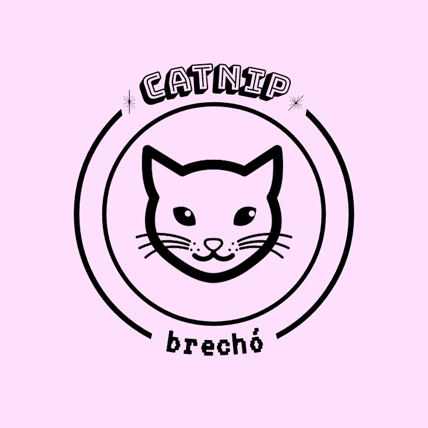

<h1 align="center">
    
</h1>

  <a href="#backend-da-aplicação">Início</a>&nbsp;&nbsp;|&nbsp;&nbsp;
  <a href="#tecnologias">Tecnologias</a>&nbsp;&nbsp;|&nbsp;&nbsp;
  <a href="#adições-futuras">Adições futuras</a>

# Backend da aplicação

- Realiza os cadastro de Usuário, Cliente, Produto e Pedidos

- Controles de autenticação por rota

- Usando banco de dados SQLite

## Tecnologias

- Esse projeto está sendo desenvolvido com as seguintes tecnologias:
  - [Node.js](https://nodejs.org/en/)

### Adições futuras

- Receber imagens do frontend e armazenar

- Criação das novas rotas (cidades, estados, etc)